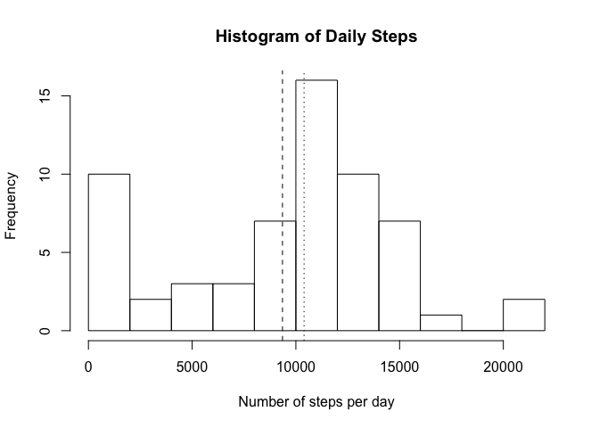
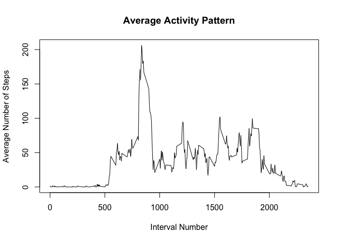
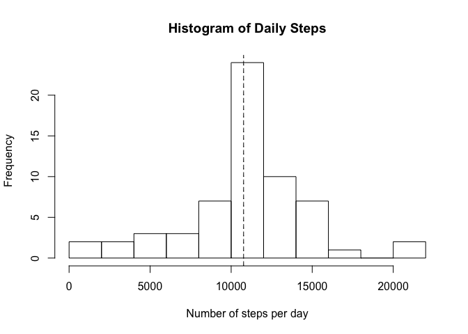
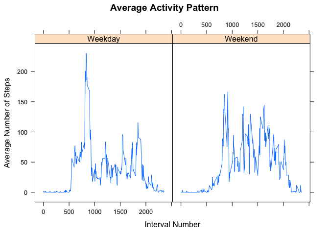

# Reproducible Research: Peer Assessment 1

#Introduction
## File Structure of Commit
* activity.zip - Zipped dataset.
* Assignment1.md - Produced markdown file.
* Assignment1.Rmd - This R markdown file.
* Assignment1_files - Directory were all figures that are produced are stored.
* README.md - Included readme file for assignment.
* src - Directory containing all the code used for the analysis.

## Loading and preprocessing the data
The code for unzipping, loading and preprocessing is found in src/IO.R.

Code in src/IO.R:

```
## [1] "library(stringr)"                                               
## [2] ""                                                               
## [3] "filename <- 'activity'"                                         
## [4] "unzip(str_c(filename, '.zip'))"                                 
## [5] "data <- read.csv(str_c(filename, '.csv'))"                      
## [6] "data$datePosix <- as.POSIXct(strptime(data$date, \"%Y-%m-%d\"))"
## [7] "file.remove(str_c(filename, '.csv'))"
```

Loading data:

```r
source('src/IO.R')
```

#Analysis Results
## What is mean total number of steps taken per day?
The code for this section is found in 
src/daily_stats.R and src/hist_daily.R.

Code in src/daily_stats.R:

```
##  [1] "# Function returns the total step for a given date."                                     
##  [2] "sum_steps_daily <- function(f_date, data) {"                                             
##  [3] "  return(sum(data$steps[data$date == f_date],na.rm=TRUE))"                               
##  [4] "}"                                                                                       
##  [5] ""                                                                                        
##  [6] "# Function returns the step sum for each day."                                           
##  [7] "sum_steps_daily_dataframe <- function(data) {"                                           
##  [8] "  sums <- sapply(levels(data$date), sum_steps_daily, data, USE.NAMES = FALSE)"           
##  [9] "  return(data.frame(date_fctr = levels(data$date), sum = sums))"                         
## [10] "}"                                                                                       
## [11] ""                                                                                        
## [12] "# Function averages across all days for a given interval."                               
## [13] "average_interval_days <- function(interval, data){"                                      
## [14] "  return(mean(data$steps[data$interval == interval], na.rm = TRUE))"                     
## [15] "}"                                                                                       
## [16] ""                                                                                        
## [17] "# Function returns the average  number of steps for each interval averaged as "          
## [18] "# a function of days."                                                                   
## [19] "interval_average <- function(data) {"                                                    
## [20] "  means <- sapply(unique(data$interval), average_interval_days, data, USE.NAMES = FALSE)"
## [21] "  return(data.frame(interval = unique(data$interval), mean = means))"                    
## [22] "}"
```

Code in src/hist_daily.R:

```
##  [1] "source('src/daily_stats.R')"                                          
##  [2] ""                                                                     
##  [3] "daily_sum_steps <- sum_steps_daily_dataframe(data)"                   
##  [4] "hist(daily_sum_steps$sum, breaks=10, xlab='Number of steps per day', "
##  [5] "     ylab='Frequency', main= 'Histogram of Daily Steps')"             
##  [6] "abline(v=mean(daily_sum_steps$sum), lty=2)"                           
##  [7] "abline(v=median(daily_sum_steps$sum), lty=3)"                         
##  [8] "print('The mean number of steps is:')"                                
##  [9] "print(mean(daily_sum_steps$sum))"                                     
## [10] "print('The median number of steps per day is:')"                      
## [11] "print(median(daily_sum_steps$sum))"
```

Creating histogram and outputs mean/median for # of steps/day:

```r
source('src/hist_daily.R')
```

<!-- -->

```
## [1] "The mean number of steps is:"
## [1] 9354.23
## [1] "The median number of steps per day is:"
## [1] 10395
```

## What is the average daily activity pattern?
The code for this section is found in 
src/daily_stats.R and src/daily_pattern.R.

Code in src/daily_stats.R:

```
##  [1] "# Function returns the total step for a given date."                                     
##  [2] "sum_steps_daily <- function(f_date, data) {"                                             
##  [3] "  return(sum(data$steps[data$date == f_date],na.rm=TRUE))"                               
##  [4] "}"                                                                                       
##  [5] ""                                                                                        
##  [6] "# Function returns the step sum for each day."                                           
##  [7] "sum_steps_daily_dataframe <- function(data) {"                                           
##  [8] "  sums <- sapply(levels(data$date), sum_steps_daily, data, USE.NAMES = FALSE)"           
##  [9] "  return(data.frame(date_fctr = levels(data$date), sum = sums))"                         
## [10] "}"                                                                                       
## [11] ""                                                                                        
## [12] "# Function averages across all days for a given interval."                               
## [13] "average_interval_days <- function(interval, data){"                                      
## [14] "  return(mean(data$steps[data$interval == interval], na.rm = TRUE))"                     
## [15] "}"                                                                                       
## [16] ""                                                                                        
## [17] "# Function returns the average  number of steps for each interval averaged as "          
## [18] "# a function of days."                                                                   
## [19] "interval_average <- function(data) {"                                                    
## [20] "  means <- sapply(unique(data$interval), average_interval_days, data, USE.NAMES = FALSE)"
## [21] "  return(data.frame(interval = unique(data$interval), mean = means))"                    
## [22] "}"
```

Code in src/daily_pattern.R:

```
##  [1] "source('src/daily_stats.R')"                                           
##  [2] ""                                                                      
##  [3] "i_avg <- interval_average(data)"                                       
##  [4] "plot(i_avg$interval, i_avg$mean, main='Average Activity Pattern', "    
##  [5] "     xlab='Interval Number', ylab='Average Number of Steps', type='l')"
##  [6] "print('Maximum number of steps for any 5-minute interval is:')"        
##  [7] "mx <- max(i_avg$mean)"                                                 
##  [8] "print(mx)"                                                             
##  [9] "print('Maximum activity occurs at interval:')"                         
## [10] "print(i_avg$interval[i_avg$mean == mx])"
```

Creating plot of the daily interval pattern and output the interval with maximum activity.:

```r
source('src/daily_pattern.R')
```

<!-- -->

```
## [1] "Maximum number of steps for any 5-minute interval is:"
## [1] 206.1698
## [1] "Maximum activity occurs at interval:"
## [1] 835
```

## Imputing missing values
I chose to impute data as a function of interval. For any interval with an NA, I replaced the NA with the average number of steps from the previous plot. Because of this I reuse one function from src/daily_stats.R.

Code for imputing data:

```
##  [1] "source('src/daily_stats.R')"                                                   
##  [2] ""                                                                              
##  [3] "impute <- function(steps, interval, avg_inter) {"                              
##  [4] "  if (is.na(steps)) {"                                                         
##  [5] "    return(avg_inter$mean[avg_inter$interval == interval])"                    
##  [6] "  }"                                                                           
##  [7] "  else {"                                                                      
##  [8] "    return(steps)"                                                             
##  [9] "  }"                                                                           
## [10] "}"                                                                             
## [11] ""                                                                              
## [12] "print('Number of NAs is:')"                                                    
## [13] "print(sum(is.na(data$steps)))"                                                 
## [14] "impute_data <- data"                                                           
## [15] "avg_inter <- interval_average(data)"                                           
## [16] "new_steps <- mapply(impute, steps = data$steps, interval = data$interval,"     
## [17] "                    MoreArgs = list(avg_inter = avg_inter), USE.NAMES = FALSE)"
## [18] "impute_data$steps <- new_steps"                                                
## [19] "print('Number of NAs after imputing:')"                                        
## [20] "print(sum(is.na(impute_data$steps)))"
```

Imputing data:

```r
source('src/imputing_data.R')
```

```
## [1] "Number of NAs is:"
## [1] 2304
## [1] "Number of NAs after imputing:"
## [1] 0
```

Again I have reused the sum function from the first histogram above. The function can be found in src/daily_stats.R

Creating histogram and outputs mean/median for # of steps/day:

```r
source('src/hist_daily_impute.R')
```

<!-- -->

```
## [1] "The mean number of steps is:"
## [1] 10766.19
## [1] "The median number of steps per day is:"
## [1] 10766.19
```

The mean and median for the number of steps taken each day has increased after imputing values. The mean increased significantly while the median increased by only a small amount. This makes sense since the NAs were producing more days with less activity than would have been normally measured.

## Are there differences in activity patterns between weekdays and weekends?
This code reused the interval averaging function from src/daily_stats.R to find the average activity throughout the day as a function of weekend and weekday. 

Code for assigning weekdays:

```
##  [1] "source('src/daily_stats.R')"                                                      
##  [2] "library(lattice)"                                                                 
##  [3] ""                                                                                 
##  [4] "is.weekend <- function(date) {"                                                   
##  [5] "  day <- weekdays(date)"                                                          
##  [6] "  if (day == \"Sunday\" | day == \"Saturday\") {"                                 
##  [7] "    return('Weekend')"                                                            
##  [8] "  }"                                                                              
##  [9] "  else {"                                                                         
## [10] "    return('Weekday')"                                                            
## [11] "  }"                                                                              
## [12] "}"                                                                                
## [13] ""                                                                                 
## [14] "assign_weekdays <- function(data) {"                                              
## [15] "  wdays <- sapply(data$datePosix, is.weekend, USE.NAMES = FALSE)"                 
## [16] "  data$wdays <- wdays"                                                            
## [17] "  return(data)"                                                                   
## [18] "}"                                                                                
## [19] ""                                                                                 
## [20] "impute_data <- assign_weekdays(impute_data)"                                      
## [21] "# Create subsetted dataframes."                                                   
## [22] "weekend_data <- subset(impute_data, wdays == 'Weekend')"                          
## [23] "weekday_data <- subset(impute_data, wdays == 'Weekday')"                          
## [24] "# Find the average steps for each interval."                                      
## [25] "weekend_inter_avg <- interval_average(weekend_data)"                              
## [26] "weekday_inter_avg <- interval_average(weekday_data)"                              
## [27] "# Create new column for the subsetted datasets marking weekend/weekday"           
## [28] "weekend_inter_avg$is.weekend <- array(data='Weekend', "                           
## [29] "                                      dim = length(weekend_inter_avg$interval))"  
## [30] "weekday_inter_avg$is.weekend <- array(data='Weekday', "                           
## [31] "                                      dim = length(weekday_inter_avg$interval)) " 
## [32] "# Remerge dataset for lattice plotting."                                          
## [33] "merged <- merge(weekday_inter_avg, weekend_inter_avg, all=TRUE)"                  
## [34] "plt <- xyplot(mean ~ interval | is.weekend, merged, xlab='Interval Number', "     
## [35] "       ylab='Average Number of Steps', main='Average Activity Pattern', type='l')"
## [36] "print(plt)"
```

Assigning weekdays to imputed dataframe and plotting average activity profile for weekdays and weekends:

```r
source('src/weekday_analysis.R')
```

<!-- -->

